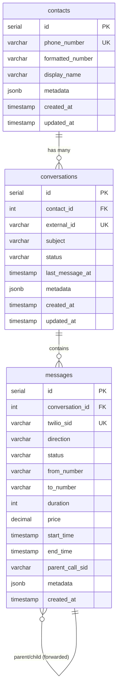
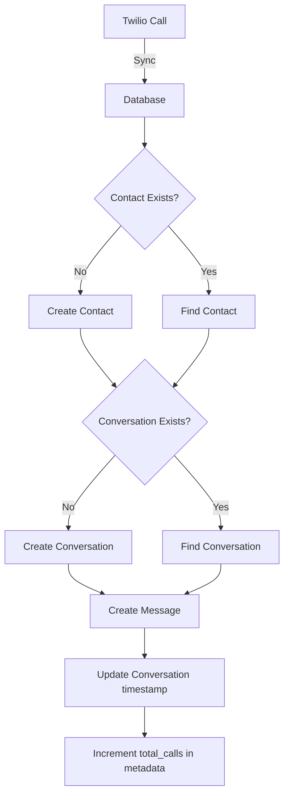

# Data Model & API Reference
**Project:** Twilio Call Viewer  
**Last Updated:** 2026-02-07

## Table of Contents
- [Database Schema](#database-schema)
- [TypeScript Data Models](#typescript-data-models)
- [Twilio API Resources](#twilio-api-resources)
- [Data Relationships](#data-relationships)

---

## Database Schema

### PostgreSQL Tables

#### 1. `contacts` Table
Stores unique phone numbers and contact information.

| Column | Type | Constraints | Description |
|--------|------|-------------|-------------|
| `id` | SERIAL | PRIMARY KEY | Auto-incrementing ID |
| `phone_number` | VARCHAR(20) | UNIQUE NOT NULL | Unique phone identifier |
| `formatted_number` | VARCHAR(30) | | Display format: +1 (XXX) XXX-XXXX |
| `display_name` | VARCHAR(255) | | Contact name or formatted number |
| `metadata` | JSONB | DEFAULT '{}' | Additional contact data |
| `created_at` | TIMESTAMP | DEFAULT NOW() | Creation timestamp |
| `updated_at` | TIMESTAMP | DEFAULT NOW() | Last update (auto-updated) |

**Indexes:**
- `idx_contacts_phone` on `phone_number`

**Triggers:**
- `update_contacts_updated_at` - Auto-updates `updated_at` column

---

#### 2. `conversations` Table
Groups calls by contact/phone number into conversation threads.

| Column | Type | Constraints | Description |
|--------|------|-------------|-------------|
| `id` | SERIAL | PRIMARY KEY | Auto-incrementing ID |
| `contact_id` | INTEGER | FK → contacts(id) | Reference to contact |
| `external_id` | VARCHAR(100) | UNIQUE NOT NULL | Phone number as external ID |
| `subject` | VARCHAR(255) | | Conversation title |
| `status` | VARCHAR(50) | DEFAULT 'active' | 'active' or 'archived' |
| `last_message_at` | TIMESTAMP | | Last call timestamp |
| `metadata` | JSONB | DEFAULT '{}' | Includes `total_calls` counter |
| `created_at` | TIMESTAMP | DEFAULT NOW() | Creation timestamp |
| `updated_at` | TIMESTAMP | DEFAULT NOW() | Last update (auto-updated) |

**Indexes:**
- `idx_conversations_contact` on `contact_id`
- `idx_conversations_last_message` on `last_message_at DESC`

**Triggers:**
- `update_conversations_updated_at` - Auto-updates `updated_at` column

**Metadata Fields:**
```json
{
  "total_calls": 5,
  "total_duration": 350,
  "last_call_direction": "inbound"
}
```

---

#### 3. `messages` Table
Individual call records from Twilio, linked to conversations.

| Column | Type | Constraints | Description |
|--------|------|-------------|-------------|
| `id` | SERIAL | PRIMARY KEY | Auto-incrementing ID |
| `conversation_id` | INTEGER | FK → conversations(id) | Parent conversation |
| `twilio_sid` | VARCHAR(100) | UNIQUE NOT NULL | Twilio Call SID (CAxxxxx) |
| `direction` | VARCHAR(50) | NOT NULL | 'inbound', 'outbound-api', 'outbound-dial' |
| `status` | VARCHAR(50) | NOT NULL | Call status (see CallStatus types) |
| `from_number` | VARCHAR(20) | NOT NULL | Caller phone number |
| `to_number` | VARCHAR(20) | NOT NULL | Recipient phone number |
| `duration` | INTEGER | | Call duration in seconds |
| `price` | DECIMAL(10,4) | | Call cost (negative = charge) |
| `price_unit` | VARCHAR(10) | | Currency code (e.g., 'USD') |
| `start_time` | TIMESTAMP | | Call start time |
| `end_time` | TIMESTAMP | | Call end time |
| `recording_url` | TEXT | | URL to call recording (if exists) |
| `parent_call_sid` | VARCHAR(100) | | Links child calls to parent (forwarded/transferred) |
| `metadata` | JSONB | DEFAULT '{}' | Additional call data from Twilio |
| `created_at` | TIMESTAMP | DEFAULT NOW() | Record creation timestamp |

**Indexes:**
- `idx_messages_conversation` on `conversation_id`
- `idx_messages_start_time` on `start_time DESC`

**Metadata Fields:**
```json
{
  "answered_by": null,
  "queue_time": "0",
  "twilio_direction": "inbound",
  "twilio_status": "completed",
  "actual_direction": "inbound",
  "display_status": "completed",
  "merged_from_parent": false
}
```

---

### Database Relationships



---

## TypeScript Data Models

### Type Definitions

```typescript
// Call Status enum
type CallStatus = 
  | 'completed'      // Call finished successfully
  | 'busy'           // Recipient was busy
  | 'no-answer'      // Call was not answered
  | 'canceled'       // Call was canceled before connection
  | 'failed'         // Call failed to connect
  | 'in-progress'    // Call is currently active
  | 'ringing'        // Call is currently ringing
  | 'initiated'      // Call has been initiated
  | 'queued';        // Call is waiting to be initiated

// Call Direction enum
type CallDirection = 
  | 'inbound'        // Incoming call to Twilio number
  | 'outbound'       // Generic outbound
  | 'inbound-api'    // Incoming via API
  | 'outbound-api'   // Outgoing call created via API
  | 'outbound-dial'; // Outgoing call leg (forwarded call)
```

### Contact Model

```typescript
interface Contact {
  id: string;                      // Database ID
  handle: string;                  // Phone number (primary identifier)
  name?: string;                   // Display name (optional)
  avatar_url?: string;             // Avatar URL (optional)
  
  metadata: {
    formatted_number: string;      // "+1 (415) 555-1234"
    country_code?: string;         // "US"
    is_mobile?: boolean;           // true/false
  };
  
  created_at: number;              // Unix timestamp (milliseconds)
  updated_at: number;              // Unix timestamp (milliseconds)
}
```

### Conversation Model

```typescript
interface Conversation {
  id: string;                      // Database ID
  external_id: string;             // Phone number
  subject: string;                 // "Calls with +1 (555) 123-4567"
  status: 'active' | 'archived';   // Conversation status
  last_message: Message | null;    // Most recent call (populated)
  last_message_at: number;         // Unix timestamp (milliseconds)
  unread_count: number;            // Always 0 (calls don't have unread state)
  contact: Contact;                // Associated contact (populated)
  
  metadata: {
    total_calls: number;           // Total number of calls
    total_duration: number;        // Total call duration (seconds)
    last_call_direction: CallDirection;
  };
  
  created_at: number;              // Unix timestamp (milliseconds)
  updated_at: number;              // Unix timestamp (milliseconds)
}
```

### Message (Call) Model

```typescript
interface Message {
  id: string;                      // Database ID
  external_id: string;             // Twilio Call SID (CAxxxxx)
  type: 'call';                    // Always 'call' (not SMS)
  direction: CallDirection;        // Call direction
  created_at: number;              // Unix timestamp (milliseconds)
  
  // Call-specific fields
  call: Call;                      // Embedded call details
  
  // Display fields
  subject: string;                 // "📞 Inbound call - 40s"
  body: string;                    // Status description
  blurb: string;                   // Short preview text
  
  // Relations
  conversation_id: string;         // Parent conversation ID
  contact: Contact;                // Associated contact (populated)
  
  // Metadata with call status and details
  metadata: {
    call_sid: string;              // Twilio SID
    duration: number;              // Call duration (seconds)
    status: CallStatus;            // Call status
    recording_url?: string;        // Recording URL (if exists)
    from_number: string;           // Caller number
    to_number: string;             // Recipient number
    parent_call_sid?: string;      // Parent call (if forwarded)
    total_duration?: number;       // Total duration
    talk_time?: number;            // Active talk time
    wait_time?: number;            // Queue/wait time
    merged_from_parent?: boolean;  // Merged with parent
    [key: string]: any;            // Additional fields
  };
}
```

### Call (Embedded) Model

```typescript
interface Call {
  sid: string;                     // Twilio Call SID
  from: string;                    // Caller phone number
  to: string;                      // Recipient phone number
  duration: number;                // Call duration (seconds)
  status: CallStatus;              // Call status
  direction: CallDirection;        // Call direction
  recording_url?: string;          // Recording URL (optional)
  price?: string;                  // Call cost ("-0.01400")
  answered_by?: string;            // Answering party (optional)
  start_time: string;              // ISO 8601 timestamp
  end_time?: string;               // ISO 8601 timestamp (optional)
}
```

---

## Twilio API Resources

### Twilio CLI Structure

```
twilio
├── api                          # Advanced API access
│   ├── core                     # Core API (api.twilio.com)
│   │   ├── calls                # Call resources ⭐
│   │   ├── recordings           # Recording resources ⭐
│   │   ├── messages             # SMS/MMS resources
│   │   ├── incoming-phone-numbers # Phone number management ⭐
│   │   ├── conferences          # Conference calls
│   │   ├── applications         # TwiML apps
│   │   └── [30+ more topics]
│   ├── conversations            # Conversations API
│   ├── messaging                # Messaging services
│   ├── voice                    # Voice services
│   └── [40+ more topics]
├── phone-numbers                # Phone number management
├── debugger                     # Log events
└── config                       # CLI configuration
```

### Key API Topics (Used in Project)

#### 1. `api:core:calls` ⭐
**Description:** Call resources and management

**Available Commands:**
- `create` - Create outbound call
- `fetch` - Get call details by SID
- `list` - List calls (with filters)
- `update` - Redirect or terminate call
- `remove` - Delete call record

**Sub-resources:**
- `calls:recordings` - Call recordings
- `calls:events` - Call events and webhooks
- `calls:streams` - Media streams
- `calls:transcriptions` - Call transcriptions
- `calls:payments` - Payment processing during calls
- `calls:notifications` - Error notifications

**List Filters:**
```bash
twilio api:core:calls:list \
  --start-time-after "2026-02-04T00:00:00Z" \
  --limit 100 \
  -o json
```

---

#### 2. `api:core:recordings`
**Description:** Recordings of phone calls

**Available Commands:**
- `fetch` - Get recording by SID
- `list` - List all recordings
- `remove` - Delete recording

**Sub-resources:**
- `recordings:transcriptions` - Text transcriptions
- `recordings:add-on-results` - Add-on API call results

**Access Recording:**
```
https://api.twilio.com/2010-04-01/Accounts/{AccountSid}/Recordings/{RecordingSid}
```

---

#### 3. `api:core:incoming-phone-numbers`
**Description:** Phone number management

**Available Commands:**
- `list` - List owned phone numbers
- `fetch` - Get phone number details
- `create` - Purchase phone number
- `update` - Update phone number config
- `remove` - Release phone number

**Sub-types:**
- `local` - Local phone numbers
- `toll-free` - Toll-free numbers
- `mobile` - Mobile numbers

---

#### 4. `api:core:messages`
**Description:** SMS/MMS messaging (not currently used)

**Available Commands:**
- `create` - Send message
- `list` - List messages
- `fetch` - Get message details
- `update` - Redact or cancel message
- `remove` - Delete message

---

### Twilio Call Object (API Response)

```json
{
  "sid": "CA5bef499f976fd46ea521f3da237abf27",
  "accountSid": "AC_YOUR_ACCOUNT_SID",
  "parentCallSid": "CAe4616d11d7f38afcfaf0bb73a0c55820",
  "from": "+16175006181",
  "fromFormatted": "(617) 500-6181",
  "to": "+19788447773",
  "toFormatted": "(978) 844-7773",
  "phoneNumberSid": null,
  "status": "completed",
  "direction": "outbound-dial",
  "startTime": "2026-02-06T15:17:13.000Z",
  "endTime": "2026-02-06T15:17:53.000Z",
  "duration": "40",
  "price": "-0.01400",
  "priceUnit": "USD",
  "answeredBy": null,
  "forwardedFrom": null,
  "queueTime": "0",
  "apiVersion": "2010-04-01",
  "dateCreated": "2026-02-06T15:17:05.000Z",
  "dateUpdated": "2026-02-06T15:17:53.000Z",
  "uri": "/2010-04-01/Accounts/AC.../Calls/CA....json",
  "subresourceUris": {
    "recordings": "/2010-04-01/Accounts/AC.../Calls/CA.../Recordings.json",
    "events": "/2010-04-01/Accounts/AC.../Calls/CA.../Events.json",
    "notifications": "/2010-04-01/Accounts/AC.../Calls/CA.../Notifications.json",
    "transcriptions": "/2010-04-01/Accounts/AC.../Calls/CA.../Transcriptions.json",
    "payments": "/2010-04-01/Accounts/AC.../Calls/CA.../Payments.json",
    "streams": "/2010-04-01/Accounts/AC.../Calls/CA.../Streams.json",
    "siprec": "/2010-04-01/Accounts/AC.../Calls/CA.../Siprec.json",
    "user_defined_messages": "/2010-04-01/Accounts/AC.../Calls/CA.../UserDefinedMessages.json",
    "user_defined_message_subscriptions": "/2010-04-01/Accounts/AC.../Calls/CA.../UserDefinedMessageSubscriptions.json"
  }
}
```

### Call Status Values

| Status | Description | Is Final? |
|--------|-------------|-----------|
| `queued` | Call is waiting to be initiated | No |
| `initiated` | Call has been initiated | No |
| `ringing` | Call is currently ringing | No |
| `in-progress` | Call is active and connected | No |
| `completed` | Call finished successfully | Yes |
| `busy` | Recipient was busy | Yes |
| `no-answer` | Call was not answered | Yes |
| `canceled` | Call was canceled before connection | Yes |
| `failed` | Call failed to connect | Yes |

### Call Direction Types

| Direction | Description | Example |
|-----------|-------------|---------|
| `inbound` | Incoming call to Twilio number | Customer calls your number |
| `outbound-api` | Outgoing call created via API | You call customer via API |
| `outbound-dial` | Outgoing call leg (child call) | Forwarded call to agent |

### Parent/Child Call Relationships

When calls are forwarded or transferred, Twilio creates:
- **Parent Call** - Original incoming call
- **Child Call(s)** - Forwarded legs (linked via `parent_call_sid`)

**Example:**
```
Parent: CA123 (inbound from +1-555-1234)
  └── Child: CA456 (outbound-dial to dispatcher SIP)
```

---

## Data Relationships

### Call Flow: Twilio → Database



### Conversation Grouping Logic

**Rules:**
1. **External Party Phone Number** - All calls with the same external phone number are grouped into one conversation
2. **SIP URI Normalization** - SIP addresses are converted to phone numbers
   - `sip:+15085140320@...` → `+1 (508) 514-0320`
3. **Parent/Child Linking** - Child calls are grouped with parent's conversation
   - Child call finds parent via `parent_call_sid`
   - Uses parent's conversation instead of creating new one

**Example:**
```
Conversation ID: 1 (external_id: "+1 (978) 844-7773")
├── Message 1: Inbound call from +1 (978) 844-7773
├── Message 2: Outbound-dial to SIP (child call, linked to parent)
└── Message 3: Another inbound from +1 (978) 844-7773
```

---

## API Endpoints (Backend)

### GET `/api/conversations`
Returns all conversations with pagination.

**Query Parameters:**
- `limit` (default: 20)
- `offset` (default: 0)

**Response:**
```json
{
  "conversations": [Conversation[]],
  "total": number
}
```

### GET `/api/conversations/:id/messages`
Returns all messages (calls) for a conversation.

**Response:**
```json
{
  "messages": [Message[]],
  "total": number
}
```

### POST `/api/sync/today`
Manually trigger sync of calls from last 3 days.

**Response:**
```json
{
  "success": true,
  "message": "Synced X new calls from last 3 days",
  "synced": number,
  "skipped": number,
  "total": number
}
```

---

## Common Queries

### Get Active Calls
```sql
SELECT m.*, c.external_id as conversation_phone
FROM messages m
JOIN conversations c ON m.conversation_id = c.id
WHERE m.status IN ('queued', 'initiated', 'ringing', 'in-progress')
ORDER BY m.start_time DESC;
```

### Get Call Statistics by Contact
```sql
SELECT 
  co.formatted_number,
  COUNT(m.id) as total_calls,
  SUM(m.duration) as total_duration,
  MAX(m.start_time) as last_call
FROM contacts co
JOIN conversations cv ON co.id = cv.contact_id
JOIN messages m ON cv.id = m.conversation_id
GROUP BY co.id, co.formatted_number
ORDER BY last_call DESC;
```

### Find Parent-Child Call Pairs
```sql
SELECT 
  parent.twilio_sid as parent_sid,
  parent.direction as parent_direction,
  child.twilio_sid as child_sid,
  child.direction as child_direction
FROM messages parent
JOIN messages child ON parent.twilio_sid = child.parent_call_sid
ORDER BY parent.start_time DESC;
```

---

## Key Insights

### Phone Number Formatting
- **Storage Format:** `+1 (XXX) XXX-XXXX` (unified format)
- **SIP URIs:** Extracted and normalized to E.164 format
- **Display:** Uses `formatted_number` from contacts table

### Sync Strategy
- **Initial Sync:** Last 7 days (100 calls limit)
- **Manual Refresh:** Last 3 days (500 calls limit)
- **Recent Sync:** Last 1 hour (50 calls limit)
- **Parent-First Processing:** Ensures parent calls exist before child calls

### Status Updates
- Calls can transition from `in-progress` → `completed`
- The sync service updates existing records when status changes
- Only final status transitions trigger updates

### Metadata Usage
- **Contacts:** Reserved for future expansion
- **Conversations:** Stores `total_calls` counter, auto-incremented
- **Messages:** Stores raw Twilio data + processed fields

---

## Future Enhancements

### Planned Features
- [ ] Recording playback in UI
- [ ] Call transcriptions
- [ ] Real-time call status updates (WebSockets)
- [ ] SMS message integration
- [ ] Contact name customization
- [ ] Call notes and tags
- [ ] Analytics dashboard

### Potential Data Additions
- **Contacts Table:**
  - `company_name`
  - `tags` (JSONB array)
  - `notes` (TEXT)
  
- **Messages Table:**
  - `transcription_text` (TEXT)
  - `sentiment_score` (DECIMAL)
  - `tags` (JSONB)

---

