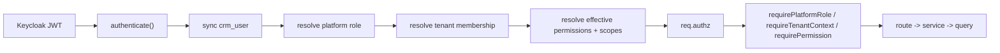

# Technical Design: PF007 — Multi-tenant Company Model, Super Admin & RBAC

**Дата:** 2026-03-24
**Статус:** Proposed
**Связанный functional spec:** `PF007-multitenant-company-model-rbac.md`

---

## 1. Design intent

PF007 должен превратить текущую auth/user схему из простого role gate в две отдельные плоскости:

- `identity plane` — `Keycloak`
- `authorization plane` — tenant memberships, fixed system roles, role permission matrices, employee-level permission overrides, advanced scopes

Ключевая техническая цель:

- убрать глобальный `super_admin` bypass;
- не вводить второй identity provider;
- встроить новую модель в текущие `users/settings/auth` поверхности.

---

## 2. Current system reuse

### Existing frontend surfaces to reuse

- `frontend/src/auth/AuthProvider.tsx`
- `frontend/src/auth/ProtectedRoute.tsx`
- `frontend/src/pages/CompanyUsersPage.tsx`
- `frontend/src/pages/SuperAdminPage.tsx`
- `frontend/src/components/layout/appLayoutNavigation.tsx`
- `frontend/src/App.tsx`

### Existing backend surfaces to reuse

- `backend/src/middleware/keycloakAuth.js`
- `backend/src/services/userService.js`
- `backend/src/routes/users.js`
- `backend/src/services/auditService.js`
- `companies`, `crm_users`, `company_memberships`

### Current gaps

- `super_admin` проходит `requireRole` и `requireCompanyAccess` как universal override;
- tenant roles ограничены `company_admin/company_member`;
- frontend route guards завязаны на hardcoded role arrays;
- `CompanyUsersPage` не имеет configurable role matrices, employee-level permission overrides и расширенного user profile;
- authorization logic не выражена как reusable capability layer.

---

## 3. Target architecture

### Backend modules

Новые и расширяемые слои:

- `backend/src/middleware/keycloakAuth.js`
  - identity verification
  - platform role resolution
  - tenant membership resolution
  - effective permissions resolution
- `backend/src/middleware/authorization.js`
  - `requirePlatformRole(...)`
  - `requireTenantContext()`
  - `requirePermission(...)`
- `backend/src/routes/platformCompanies.js`
- `backend/src/routes/rolesPermissions.js`
- `backend/src/routes/companySettings.js`
- `backend/src/services/companyService.js`
- `backend/src/services/authorizationService.js`
- `backend/src/services/roleService.js`
- `backend/src/services/membershipService.js`
- `backend/src/db/companyQueries.js`
- `backend/src/db/roleQueries.js`
- `backend/src/db/membershipQueries.js`

### Frontend modules

- `frontend/src/auth/AuthProvider.tsx`
  - загрузка `GET /api/auth/me`
  - хранение effective permissions/scopes
- `frontend/src/auth/ProtectedRoute.tsx`
  - переход от `roles=[...]` к permission-aware contract
- `frontend/src/pages/SuperAdminPage.tsx`
  - platform companies + existing auth policy/session tools
- `frontend/src/pages/CompanyUsersPage.tsx`
  - team management V2
- `frontend/src/pages/RolesPermissionsPage.tsx`
  - новый tenant workspace
- `frontend/src/hooks/useAuthz.ts`
- `frontend/src/services/authzApi.ts`
- `frontend/src/services/teamManagementApi.ts`

Rule:

- UI hides unavailable actions;
- backend is authoritative;
- no raw page-level RBAC branching based only on `hasRole(...)`.

---

## 4. Authorization flow

### Request context contract

Каждый authed request после PF007 должен иметь:

- `req.user`
  - identity from Keycloak
- `req.authz.scope`
  - `platform` или `tenant`
- `req.authz.platform_role`
  - `none | super_admin`
- `req.authz.company`
  - current tenant company or `null`
- `req.authz.membership`
  - current active membership or `null`
- `req.authz.permissions`
  - resolved permission keys
- `req.authz.scopes`
  - advanced restrictions

---

## 5. Key design decisions

### 5.1 Keycloak stays, tenant RBAC moves to DB

Причина:

- custom tenant roles нельзя адекватно выразить только realm roles;
- tenant roles должны быть company-scoped;
- PF007 требует управлять правами без изменения Keycloak realm модели на каждый новый role variant.

### 5.2 `super_admin` becomes platform-only

Причина:

- user explicitly requires no access into tenant companies;
- текущий bypass ломает tenant isolation model;
- platform admin use cases — это company lifecycle и platform security, а не business operations.

Следствие:

- `requireCompanyAccess` больше не делает `req.companyFilter = {}` для `super_admin`;
- super admin получает только platform routes.

### 5.3 Membership is authoritative, not `crm_users.role`

Причина:

- `crm_users.role` не годится для custom company roles;
- user-role inside tenant должен быть membership-scoped;
- текущий `company_id` в `crm_users` допустим только как compatibility shadow.

### 5.4 Fixed system roles + per-company matrices + per-user overrides

Причина:

- пользователь явно не хочет `custom roles`;
- модель ближе к Zenbooker: системная роль + настройка role matrix + granular toggles в employee profile;
- это проще в governance, миграции и support, чем tenant-specific role proliferation.

Следствие:

- tenant использует только `Tenant Admin`, `Manager`, `Dispatcher`, `Provider`;
- `Roles & Permissions` редактирует матрицу разрешений для этих ролей;
- в профиле сотрудника админ может менять только overrideable permissions/scopes.

### 5.5 Field tech profile is separate from role

Причина:

- это соответствует Workiz-like model;
- одна и та же системная роль не обязана автоматически делать пользователя assignable provider;
- route logic и schedule logic позже смогут опираться на профиль, а не только на role name.

---

## 6. Route protection strategy

### Current state

- `requireRole('company_admin')`
- `ProtectedRoute roles=['company_admin']`

### Target state

- `requirePlatformRole('super_admin')`
- `requireTenantContext()`
- `requirePermission('tenant.users.manage')`
- `requirePermission('jobs.close')`

### Migration rule

На rollout-период допустим compatibility adapter:

- `company_admin` -> `Tenant Admin`
- `company_member` -> transitional `Dispatcher` until tenant admin explicitly reassigns narrower role/profile

Но новые routes и новые pages не должны проектироваться вокруг `company_admin/company_member`.

---

## 7. Frontend access model

### Current state

- `AuthProvider` хранит roles из token
- `ProtectedRoute` проверяет `hasRole(...)`
- navigation partly завязана на `super_admin/company_admin`

### Target state

`AuthProvider` должен отдавать:

- `user`
- `platformRole`
- `company`
- `membership`
- `permissions`
- `scopes`
- helpers:
  - `hasPermission(...)`
  - `hasAnyPermission(...)`
  - `hasPlatformRole(...)`

### Navigation implications

- `/settings/admin` виден только platform super admin
- tenant navigation строится только при наличии tenant context
- finance/reporting widgets и menu entries скрываются capability-based
- action buttons на detail screens должны зависеть от effective permissions, а не от route-level role only checks

---

## 8. Data model strategy

### Reuse

- `companies`
- `crm_users`
- `company_memberships`

### Add

- `company_role_configs`
- `company_role_permissions`
- `company_role_scopes`
- `company_membership_permission_overrides`
- `company_membership_scope_overrides`
- `company_user_profiles`
- `company_user_service_areas`
- `company_user_skills`
- `company_invitations`

### Deprecate gradually

- `crm_users.role` as authorization source
- `company_memberships.role` as final role source
- direct `req.user.company_id` assumptions in routes

---

## 9. Integration with current product modules

PF007 должен быть встроен в уже существующие домены.

### Pulse / Messages

- assigned-job restrictions влияют на client thread visibility;
- internal/team messages должны отличаться от client messages permission-wise.

### Jobs / Leads / Contacts

- job visibility, close-job permission, assigned-only filters;
- later `service areas / skills` должны использоваться для dispatch suggestions.

### Payments

- `financial_data.view`, `payments.collect_online`, `payments.collect_offline` должны определять и read, и action surface.

### Telephony

- текущий `phone_calls_allowed` становится частью unified authz/profile model;
- telephony settings остаются tenant-admin capabilities, а не manager/dispatcher defaults.

### Future PF001..PF006

- `Schedule`: `schedule.view`, `schedule.dispatch`, service areas, provider status
- `Estimates / Invoices / Payments`: finance visibility and collection permissions
- `Client Portal`: admin configuration rights
- `Automation Engine`: role-based access to rules and audit

---

## 10. Rollout phases

### Phase 1

- data model contracts
- platform vs tenant scope
- first admin invariant
- `GET /api/auth/me`

### Phase 2

- platform companies in `SuperAdminPage`
- team management V2 in `CompanyUsersPage`
- fixed role matrices

### Phase 3

- employee permission overrides
- permission-aware navigation
- backend `requirePermission(...)`

### Phase 4

- advanced restrictions
- field-tech profile integrations
- migration cleanup

---

## 11. Main risks

- слишком резкий отказ от текущих `company_admin/company_member`
- route-level permission drift между frontend и backend
- скрытые global bypass paths через старые middleware helpers
- зависимость будущих PF001..PF006 от ещё не завершённой capability модели

### Mitigation

- compatibility mapping на rollout-период
- один canonical `GET /api/auth/me`
- один backend authorization service
- priority implementation before mass rollout of new tenant modules

---

## 12. Protected areas

- `src/server.js` runtime wiring
- `frontend/src/services/apiClient.ts`
- `frontend/src/hooks/useRealtimeEvents.ts`
- `backend/db/` migrations only through staged rollout
- legacy `src/routes/*` and `src/services/*` must not become the new RBAC home
